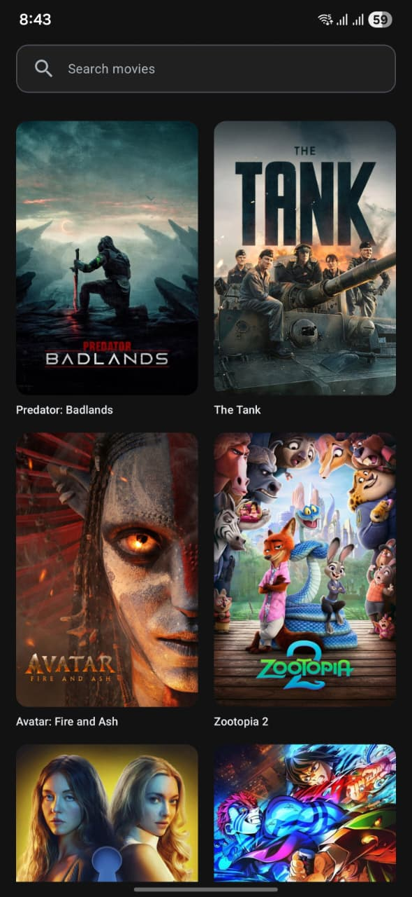
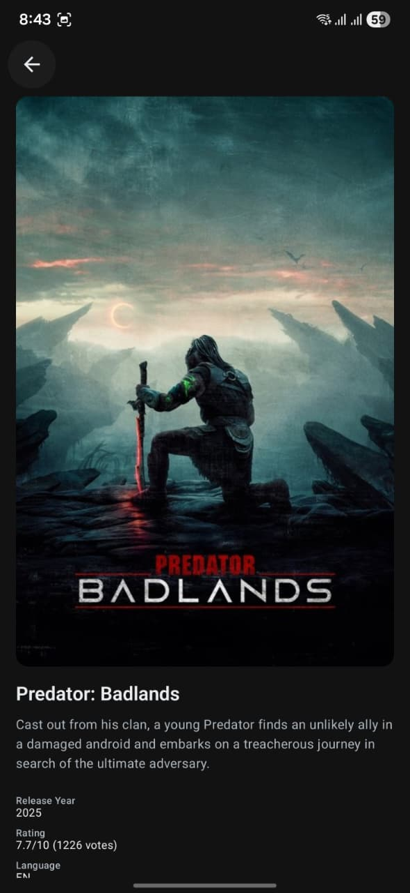

# TMDB Movie App

A modern Android movie app built with Jetpack Compose that displays trending movies from TMDB API with offline support.

## Features

- **Movie List**: Browse trending movies in a beautiful 2-column grid
- **Search**: Search movies with debounced input (300ms)
- **Movie Details**: View detailed information about any movie
- **Offline Support**: Movies are cached locally for offline viewing
- **Dark Mode**: Automatic dark/light theme based on system settings
- **Search History**: Recent searches are saved for quick access

## Demo

### Demo Videos

#### Main App Demo
https://github.com/user-attachments/assets/demo.mp4

*Complete walkthrough of the app features including movie list, search, and detail screens.*

#### Offline Cache Demo
https://github.com/user-attachments/assets/offline_cache_demo.mp4

*Demonstrates offline functionality - app works seamlessly without internet connection using cached data.*

#### Theme Toggle Demo
https://github.com/user-attachments/assets/theme_toggle.mp4

*Shows dark mode and light mode switching with smooth transitions.*

### UI Screenshots

#### Movie Listing Page


*Main screen displaying trending movies in a 2-column grid with search functionality.*

#### Movie Details Page


*Detailed view of a selected movie with poster, title, and overview information.*

## Architecture

The app follows **Clean Architecture** with **MVVM** pattern:

```
app/
├── data/                    # Data layer
│   ├── local/              # Room database, DAOs, entities
│   ├── remote/             # Retrofit API, DTOs
│   ├── mapper/             # Data mappers
│   └── repository/         # Repository implementations
├── di/                      # Hilt dependency injection modules
├── domain/                  # Domain layer
│   ├── model/              # Domain models
│   ├── repository/         # Repository interfaces
│   └── usecase/            # Use cases
├── presentation/            # Presentation layer
│   ├── components/         # Reusable UI components
│   ├── navigation/         # Navigation graph
│   ├── screens/            # Screen composables & ViewModels
│   └── theme/              # App theme (colors, typography)
└── util/                    # Utility classes
```

## Tech Stack

- **UI**: Jetpack Compose with Material 3
- **Architecture**: MVVM + Clean Architecture
- **DI**: Hilt
- **Networking**: Retrofit + OkHttp + Moshi
- **Database**: Room
- **Image Loading**: Coil
- **Navigation**: Compose Navigation
- **Async**: Kotlin Coroutines + Flow

## Setup

### Prerequisites
- Android Studio Hedgehog or later
- JDK 17 or later
- Android SDK 24+

### Quick Start

1. **Clone the repository:**
   ```bash
   git clone https://github.com/your-username/TMDB-Atlys.git
   cd TMDB-Atlys
   ```

2. **Get your TMDB API key** (free, takes 2 minutes):
   - Register at [TMDB](https://www.themoviedb.org/)
   - Go to **Settings** → **API** → **Create** or **Request API Key**
   - Copy your API key

3. **Add your API key** (choose one method):

   **Option A: Using the setup script (Recommended)**
   ```bash
   ./setup_api_key.sh
   ```
   Follow the prompts to enter your API key.

   **Option B: Manual setup**
   ```bash
   # Copy the example file
   cp local.properties.example local.properties
   
   # Edit local.properties and replace YOUR_API_KEY_HERE with your actual key
   # Or use the script: ./setup_api_key.sh
   ```

4. **Sync and build:**
   - Open the project in Android Studio
   - **File** → **Sync Project with Gradle Files**
   - Build and run the app (▶️ Run button)

### Security Note

🔒 **API keys are stored securely:**
- API key is stored in `local.properties` (gitignored, never committed)
- The `local.properties.example` file is a template (safe to commit)
- This follows Android security best practices
- Your API key will never be exposed in the repository

**Why this approach?**
- Protects sensitive credentials from being committed to version control
- Allows easy setup for new developers
- Follows industry-standard security practices
- Demonstrates security awareness in code

## API Endpoints Used

- **Trending Movies**: `GET /trending/movie/week`
- **Search Movies**: `GET /search/movie`
- **Images**: `https://image.tmdb.org/t/p/{size}/{path}`

## Key Features Implementation

### Offline-First Strategy
The app implements an offline-first strategy:
1. Show cached data immediately
2. Fetch from network in background
3. Update cache and UI with fresh data
4. Show offline banner when no network

### Debounced Search
Search input is debounced by 300ms to avoid excessive API calls and provide smooth UX.

### Image Caching
Coil is configured with:
- 25% memory cache
- 5% disk cache
- Crossfade animations
- Loading shimmer placeholders

## Build Variants

- **Debug**: Logging enabled, unminified code for debugging
- **Release**: Minified, obfuscated, and optimized for production

Both variants use the API key from `local.properties`.

## Troubleshooting

### "API key not found" or "Invalid API key" errors
- Ensure `local.properties` exists in the project root
- Verify `TMDB_API_KEY=your_actual_key` is set correctly
- Run `./setup_api_key.sh` to set it up again
- Sync Gradle after updating: **File** → **Sync Project with Gradle Files**

### Build errors after cloning
- Make sure you've created `local.properties` from `local.properties.example`
- The app will use a placeholder key if `local.properties` doesn't exist (will cause API errors)

## License

This project is for educational purposes as part of a take-home assignment.
